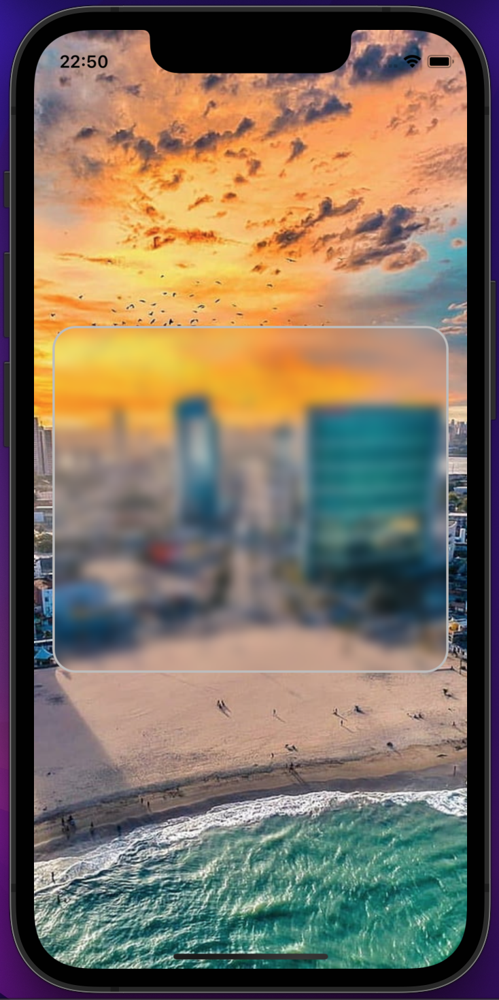

# Glassmorphism

This is a simple project containing a translucid component.

----------------------------------------------------------------

Esse é um simples projeto contendo um translúcido. 

## Getting Started

Clone the repository and run the following commands:
----------------------------------------------------------------
Clone o repositório e execute os seguintes comandos:
```
flutter pub get
flutter run
```

## Screenshots

### Glassmorphism Component


A few resources to get you started if this is your first Flutter project:
----------------------------------------------------------------
Alguns recursos para você começar se este for seu primeiro projeto Flutter:

- [Lab: Write your first Flutter app](https://flutter.dev/docs/get-started/codelab)
- [Cookbook: Useful Flutter samples](https://flutter.dev/docs/cookbook)


